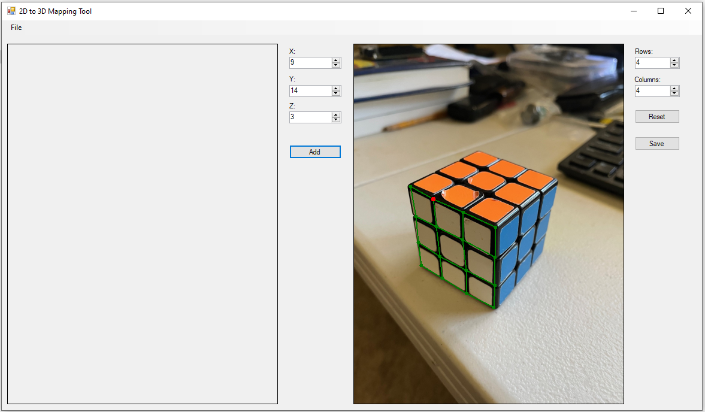
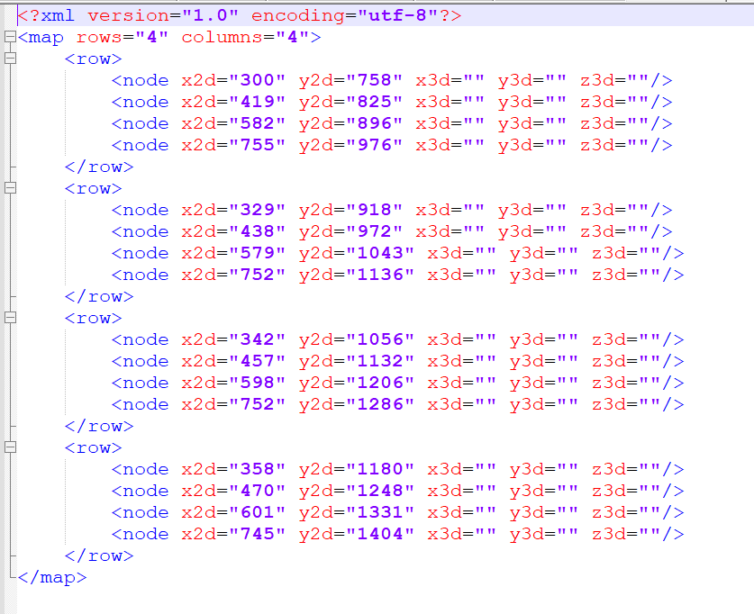

# Map2dImageTo3DCADModel

This is GUI app that helps to position the mapping grid shown in green color on the right on top of the 2D object and save it to XML file.  Coordinates are saved into XML file used to map 2d images to 3d CAD model for 3d visualization and analysis purposes.  

Note: this is unfinished project because it lost its purpose for what I needed it.  I still have the 3d viewer that utilizes the XML file.

  

[View XML](Readme/mapfile.xml)

  

